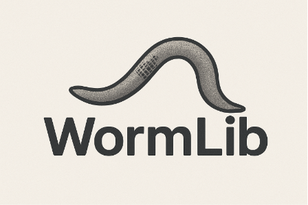

# WormLib 


[](https://opensource.org/licenses/MIT) [](https://www.python.org/) [](https://github.com/fish-quant/big-fish) [](https://github.com/MouseLand/cellpose)

**WormLib is a modular open-source image analysis library for quantifying microscopy images of *Caenorhabditis elegans* embryos. It provides an end-to-end pipeline from image loading, embryo and cell segmentation, cell identity prediction, spot detection, and spatial mRNA analysis.**
---
You can learn more about Wormlib by reading the paper [here](https://example.com/paper) and in the detailed documentation at [READTHEDOCS.io](https://wormlib.readthedocs.io). Please see install instructions below.


### Example notebooks:
[1 - Single-cell spot detection](https://github.com/TorresNaly/WormLib/blob/main/examples/1%20-%20Single-cell%20spot%20detection.ipynb)


### Citation

If you use WormLib in your research, please cite:
> **Naly Torres, Luis de Lira Aguilera, Karissa Coleman, Richard Bruno, Brian Munsky, Erin Osborne Nishimura** *WormLib: A Modular Image Analysis Library for Quantifying C. elegans Microscopy.* (In preparation)

---

## Installation

### Option #1: Quick Install With Conda

```bash
# Clone the repository
git clone https://github.com/erinosb/WormLib.git
cd WormLib

# Create and activate the tested WormLib environment
conda env create -f installation/wormlib.yml
conda activate wormlib
```

This installs the core scientific stack through conda and the remaining
WormLib dependencies through pip. 

#### Dependencies

| Package | Version | Purpose |
|---------|---------|---------|
| [BigFISH](https://github.com/fish-quant/big-fish) | 0.6.2 | smFISH spot detection & analysis |
| [Cellpose](https://github.com/MouseLand/cellpose) | 3.1.0 | Deep learning cell segmentation |
| [scikit-image](https://scikit-image.org/) | 0.23.2 | Image processing & morphology |
| [scikit-learn](https://scikit-learn.org/) | Conda-managed | Random Forest classifiers (transitive via joblib) |
| [PyTorch](https://pytorch.org/) | 2.4.1 | GPU backend for Cellpose |
| [OpenCV](https://opencv.org/) | 4.10.0.84 | Contour & ellipse fitting |
| [nd2](https://github.com/tlambert03/nd2) | 0.10.3 | Nikon ND2 file reader |
| [tifffile](https://github.com/cgohlke/tifffile) | 2025.6.11 | TIFF file I/O |
| [PyYAML](https://pyyaml.org/) | ≥ 6.0.1 | YAML configuration parsing |
| [ReportLab](https://www.reportlab.com/) | ≥ 4.0.8 | PDF report generation |
| [Pillow](https://python-pillow.org/) | ≥ 10.0 | Image handling for PDF reports |


### Option #2: NVIDIA GPU Install

For GPU-accelerated Cellpose segmentation on Linux/Windows with an NVIDIA GPU
and CUDA 12.4-compatible drivers:

```bash
conda env create -f installation/wormlib_cuda.yml
conda activate wormlib
```

On Apple Silicon macOS, use the default `installation/wormlib.yml`. PyTorch MPS
support is included in the regular macOS PyTorch wheels when available.

### Verify Installation

```bash
python -c "import numpy as np; import torch; from cellpose import models; import bigfish; print('WormLib dependencies OK')"
```

If you see an error indicating that a module compiled with NumPy `< 2.0` cannot
run with NumPy `≥ 2.0`, or `_ARRAY_API not found`, the active environment is not
using the pinned WormLib environment. Recreate it from the YAML file above.

---

If you already have an older or broken `wormlib` environment, remove it first:

```bash
conda deactivate
conda env remove -n wormlib
conda env create -f installation/wormlib.yml
conda activate wormlib
```

---

## License

This project is licensed under the MIT License. See [LICENSE](LICENSE) for details.


---

## Support

- **Issues & Contributions**: [GitHub](https://github.com/erinosb/WormLib/issues)
- **Repository**: [github.com/erinosb/WormLib](https://github.com/erinosb/WormLib)
